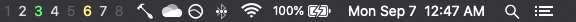

# yabai-bar

## About

A simple menu bar spaces indicator for the yabai window manager, written for Hammerspoon.

## Installation

Compatibility:
- Tested on Monterery (macOS 12).

Prerequisites:
- Install and configure [yabai](https://github.com/koekeishiya/yabai).
- Install and configure [Hammerspoon](https://github.com/Hammerspoon/hammerspoon).

Installation:
- Clone this repo.
- Create `~/.hammerspoon/init.lua` if you have not already.
  
  ```sh
  touch ~/.hammerspoon/init.lua
  ```
- Copy `yabai-bar/yabai-bar.lua` to `~/.hammerspoon/`.
  
  ```sh
  cp yabai-bar/yabai-bar.lua ~/.hammerspoon/
  ```
- Configure your `init.lua` to create a new YabaiBar.
  You must pass the absolute path to your `yabai` executable (probably `/usr/local/bin/yabai`) to
  the `:new()` constructor, then update the object.

  ```lua
  -- init.lua
  YabaiBar = require("yabai-bar"):new("/your/yabai/executable")
  YabaiBar:update()
  ```
- Configure your `yabairc` or `.yabairc` file to update the YabaiBar object appropriately.
  Because of how yabai's signals work, you will need multiple signals to catch all possible events.

  ```sh
  # yabairc

  # ...

  # for when a new space is made visible
  yabai -m signal --add event=space_changed action="hs -c 'YabaiBar:update()'"
  # for when the current display changes
  yabai -m signal --add event=display_changed action="hs -c 'YabaiBar:update()'"
  # display_changed does not trigger when the display changes
  # but the front-most application stays the same
  yabai -m signal --add event=application_front_switched action="hs -c 'YabaiBar:update()'"
  ```

## Usage

The currently focused space will appear in green.
Other visible spaces (i.e. on other desktops) will appear in yellow.
Spaces that are not visible but have visible windows will appear in light grey.
Any other spaces will appear in dark grey.

Unfortunately, not all programs play nicely with yabai and as such may not be "seen" by yabai.
As a result, dark grey spaces may still have windows there (e.g. a space with only Steam visible
will still appear dark grey).

If you refresh yabai, you will have to revisit your spaces to make sure yabai acknowledges them and
can pass the information along to YabaiBar.

## Screenshots



## Todo
- Package this extension as a proper Hammerspoon Spoon
